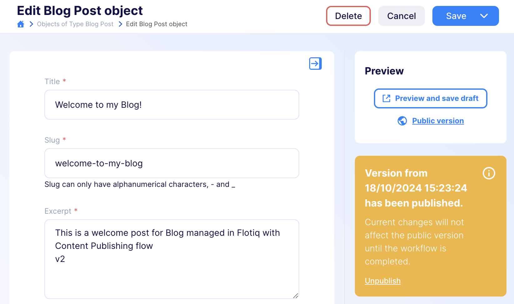
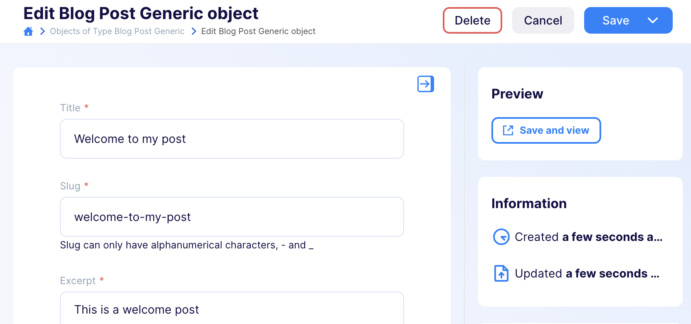
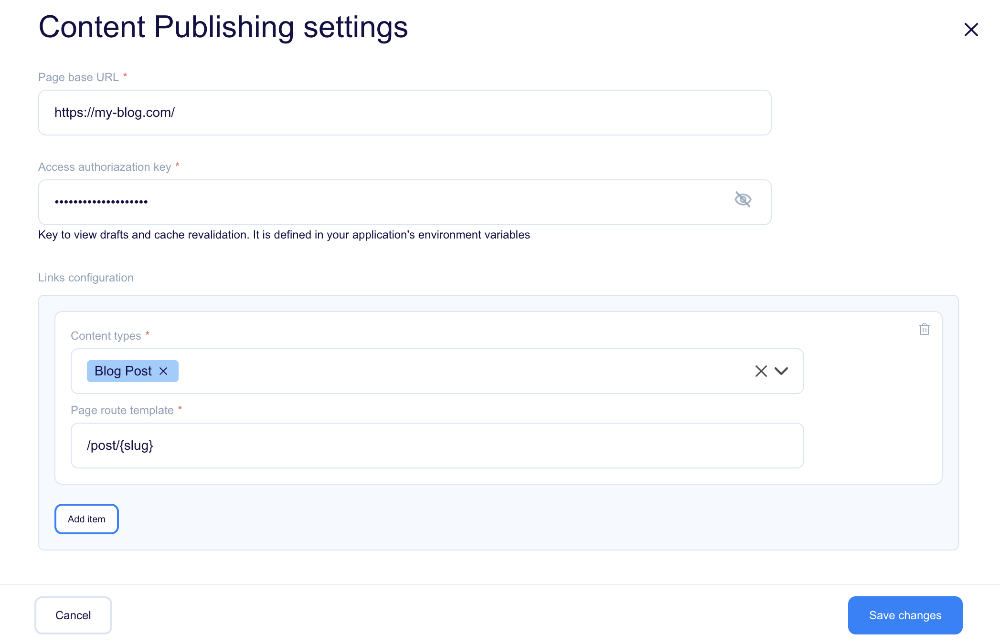

[[_TOC_]]

# Plain JS Plugin

## Overview
The plugin generates links that let you open drafts and public versions of pages directly from the editor. With one click, users can quickly save and open the draft version, streamlining their workflow for maximum efficiency. It works best with Next.js-based sites that use draft mode.

## Usage

While editing your objects, you will now have access to new actions on the right hand-side:

* Save draft and Preview/Save and view - saves you current work and opens a preview of the latest content on your website
* Public version - opens a public version of the content on your website. This button is only available when you using content publishing workflow

Examples: 

1. Content publishing workflow

   Imagine you've already published a blog post, but now you want to make some updates. Instead of publishing right away, you can use the Preview and Save Draft button. This lets you see your changes on the website before they go live. For example, it might take you to https://my-blog.com/post/welcome-to-my-post, where you'll see your unpublished edits. To compare your draft with the live version, click **Public Version**. This shows you the same page but with the content everyone else sees.

   

   This feature uses draft mode in NextJS, allowing you to view changes before they are visible to your readers.

2. Simple workflow

   With the simple workflow, any changes you save are immediately visible on your website. Click the **Save and View** button to quickly save your work and see the updated page.
   
   

## Configuration



### Page base URL

To start, you may want to use http://localhost:3000 to easily navigate between Flotiq and your local development environment. This will be accessible to all developers working on the site locally. Once you have your page deployed and publicly visible, you should change this URL.

### Client Authorisation Key

This key grants access to view drafts and perform cache revalidation on your website. Make sure to define it in your application's environment variables. Without this key, the plugin won't be able to preview unpublished content or update the cache effectively.

### Content types

Specify the types of content for which you want the plugin to generate links.

### Page route template

Define the URL template for your content pages. For example, you might use /post/{slug}, where {slug} corresponds to a specific field in your content type, such as the post's title or ID. You can also use nested fields, like {internal.createdAt}, or list fields, such as {addresses[0].city}. This flexibility allows you to customize how your content URLs are structured.

## Development

### Quick start

1. `yarn` - to install dependencies
2. `yarn start` - to start development mode - rebuild on file modifications
3. update your `plugin-manifest.json` file to contain the production URL and other plugin information
4. `yarn build` - to build plugins

### Dev environment

Dev environment is configured to use:

* `prettier` - best used with automatic format on save in IDE
* `eslint` - it is built into both `start` and `build` commands

### Output

The plugins are built into a single `dist/index.js` file. The manifest is copied to `dist/plugin-manifest.json` file.

### Deployment

<!-- TO DO -->

### Loading the plugin

**Warning:** While developing, you can use  `https://localhost:3053/plugin-manifest.json` address to load the plugin manifest. Make sure your browser trusts the local certificate on the latter, to be able to use it e.g. with `https://editor.flotiq.com`

#### URL

**Hint**: You can use localhost url from development mode `https://localhost:3053/index.js`

1. Open Flotiq editor
2. Open Chrome Dev console
3. Execute the following script
   ```javascript
   FlotiqPlugins.loadPlugin('plugin-id', '<URL TO COMPILED JS>')
   ```
4. Navigate to the view that is modified by the plugin

#### Directly

1. Open Flotiq editor
2. Open Chrome Dev console
3. Paste the content of `dist/index.js` 
4. Navigate to the view that is modified by the plugin

#### Deployment

**Hint**: You can use localhost url from development mode `https://localhost:3053/plugin-manifest.json`

1. Open Flotiq editor
2. Add a new plugin and paste the URL to the hosted `plugin-manifest.json` file
3. Navigate to the view that is modified by the plugin
